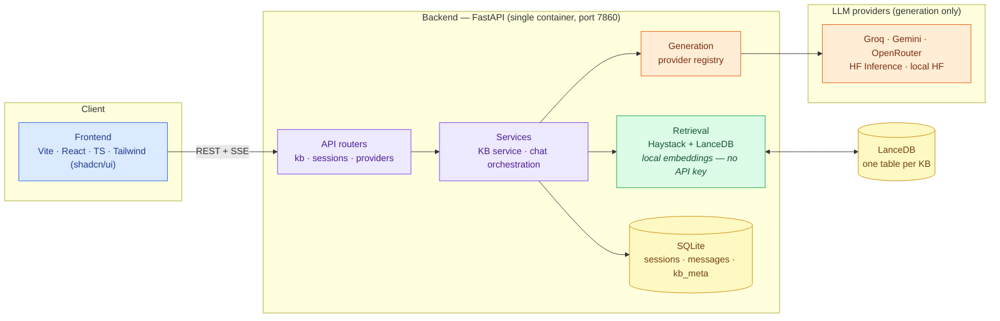
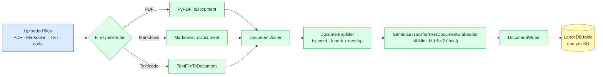
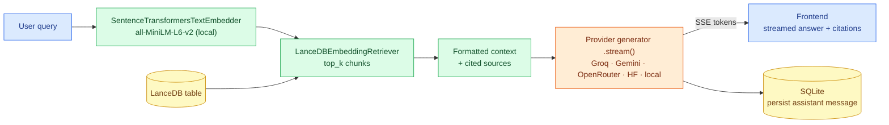

# Local RAG

A retrieval-augmented chat app with a **Vite + React + TypeScript + Tailwind
(shadcn/ui)** frontend and a **FastAPI** backend that reuses a local **Haystack +
LanceDB** retrieval pipeline. Answer generation is provider-swappable (Groq,
Google Gemini, OpenRouter, Hugging Face Inference, or a fully-local HuggingFace
model). Embeddings and retrieval always run locally.

## Features

- **Session history** — chats persist in SQLite; browse, resume, rename, delete.
- **Knowledge bases (KBs)** — each KB is an isolated LanceDB table.
  - Create a new KB from one or many files (PDF, TXT, Markdown, code).
  - Upload individual or batch files into an existing KB.
  - Every KB gets an **auto-generated description** (topic + example questions)
    to tell them apart.
  - Manage a KB: list indexed files, delete a file, or clear the KB.
- **Grounded answers with citations** — inline `[n]` markers plus expandable
  source excerpts and scores.
- **Streaming** — token-by-token responses over **SSE**, with a stop button.
- **Swappable providers** — pick provider + model at runtime; only the selected
  provider's API key is required.

## Architecture

🟦 **Client / UI** · 🟪 **API & orchestration** · 🟩 **Retrieval &
embedding (local)** · 🟧 **Generation (LLM providers)** · 🟨 **Storage (LanceDB ·
SQLite)**.



### RAG pipeline

Retrieval (parse → split → embed → store) and query embedding run **locally**
with sentence-transformers (`all-MiniLM-L6-v2`); only answer generation calls the
selected provider. Both flows are Haystack 2.x pipelines over a persistent
LanceDB store (`backend/app/core/rag_pipeline.py`).

**Indexing** — building/updating a knowledge base:



**Query** — answering a question over a selected KB:



## Repository layout

| Path | Role |
| --- | --- |
| `backend/app/core/` | Config, logging, ported Haystack/LanceDB pipeline. |
| `backend/app/llm/` | Provider abstraction + adapters + registry. |
| `backend/app/db/` | SQLite schema + repository. |
| `backend/app/services/` | KB service (create/describe) + chat orchestration. |
| `backend/app/api/` | REST + SSE routers (`kb`, `sessions`, `providers`). |
| `frontend/src/` | React app (sidebar, chat, KB dialogs, API hooks). |

## Run locally

### 1. Backend (Python 3.11+)

```bash
cd backend
python -m venv .venv
# Windows:  .\.venv\Scripts\activate
# macOS/Linux: source .venv/bin/activate
pip install -r requirements.txt

cp .env.example .env          # then set LLM_PROVIDER + the matching API key
uvicorn app.main:app --reload --port 8000
```

Get a **free** key for your chosen provider:

- Groq: https://console.groq.com/keys
- Google Gemini: https://aistudio.google.com/apikey
- OpenRouter (has `:free` models): https://openrouter.ai/keys
- Hugging Face: https://huggingface.co/settings/tokens

To run generation **fully offline**, set `LLM_PROVIDER=local` and uncomment the
`transformers` / `torch` lines in `backend/requirements.txt`.

### 2. Frontend

```bash
cd frontend
npm install
cp .env.example .env          # VITE_API_BASE_URL=http://localhost:8000
npm run dev                   # http://localhost:5173
```

### Or with Docker Compose

```bash
GROQ_API_KEY=... docker compose up --build   # backend on :8000
```

## API overview

| Method | Path | Purpose |
| --- | --- | --- |
| `GET` | `/api/health` | Liveness check. |
| `GET` | `/api/providers` | Providers, models, configured status. |
| `GET` | `/api/kb` | List KBs with descriptions + stats. |
| `POST` | `/api/kb` | Create KB from uploaded files (multipart). |
| `GET` | `/api/kb/{kb}/files` | List indexed files. |
| `POST` | `/api/kb/{kb}/files` | Add files to a KB (multipart). |
| `DELETE` | `/api/kb/{kb}/files?file_path=…` | Delete one file. |
| `DELETE` | `/api/kb/{kb}` | Clear a KB. |
| `GET/POST` | `/api/sessions` | List / create sessions. |
| `GET/PATCH/DELETE` | `/api/sessions/{id}` | Read / update / delete a session. |
| `POST` | `/api/sessions/{id}/messages` | Send a query; **SSE** stream of tokens + sources. |

## Evaluation (dev-only)

A free/local quality-evaluation harness lives in `backend/eval/`. It is **never
shipped in the deployment image** (excluded by both Dockerfiles and
`.dockerignore`) — run it only in your local dev environment. Run everything
from the `backend/` directory:

```bash
cd backend

# End-to-end golden set: retrieval + generation quality (uses your LLM provider).
.venv/Scripts/python.exe -m eval.run_golden --limit 3
# override the provider used for generation:
.venv/Scripts/python.exe -m eval.run_golden --provider groq

# Full suite (golden set + BEIR retrieval benchmark):
.venv/Scripts/python.exe -m eval.run_all --skip-beir   # golden only
.venv/Scripts/python.exe -m eval.run_all               # + BEIR (needs datasets)
```

Metrics reported: retrieval (recall@k, precision@k, nDCG@k, MRR) plus judge-free
generation metrics (semantic similarity, answer relevancy, lexical faithfulness,
context recall/precision) and per-stage latency. Timestamped JSON reports are
written to `backend/eval/results/`.

The BEIR retrieval benchmark (SciFact / NFCorpus) is optional and needs the
`datasets` package:

```bash
pip install -r requirements-eval.txt
.venv/Scripts/python.exe -m eval.run_beir --datasets scifact --sample 20 --max-corpus 1000
```

BEIR corpora download on first run and are cached under
`backend/eval/datasets/beir_cache/` (git-ignored).

## Deploy (single container)

The root `Dockerfile` builds one image that serves both the API and the built
SPA on port `7860` (FastAPI serves `/api` plus the static frontend). This runs
on any host with Docker and a persistent disk — e.g. an **Azure VM** (Ubuntu +
Docker), Oracle Cloud, or any VPS.

```bash
# Build and run locally
docker build -t local-rag .
docker run -d --name local-rag -p 7860:7860 \
  -v localrag_data:/data \
  -e LLM_PROVIDER=groq -e GROQ_API_KEY=... \
  local-rag
# open http://localhost:7860
```

Notes:
- The named volume (or host path) mounted at `/data` keeps SQLite + LanceDB
  across restarts. On native Linux a bind mount works; on Windows/macOS use a
  **named volume** (SQLite WAL locking is unreliable over bind mounts).
- The CPU-only build bakes the embedding model into the image, so the first
  query is instant and needs no outbound Hugging Face download.
- Set `CORS_ORIGINS` if you serve the frontend from a different origin.

A Caddy-fronted multi-service variant (backend + separate frontend + HTTPS) is
kept in `deploy/oracle/` for VM deployments that want a reverse proxy.
